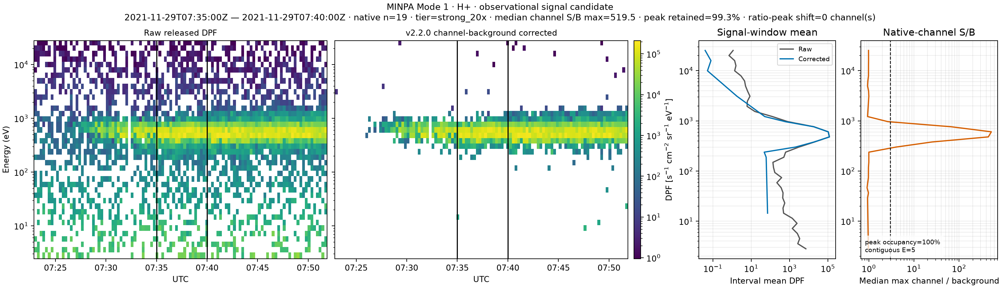
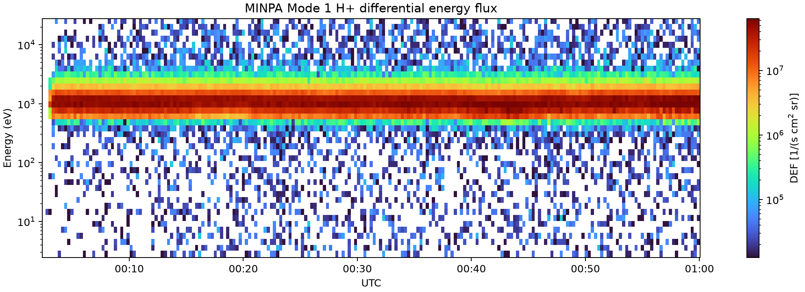
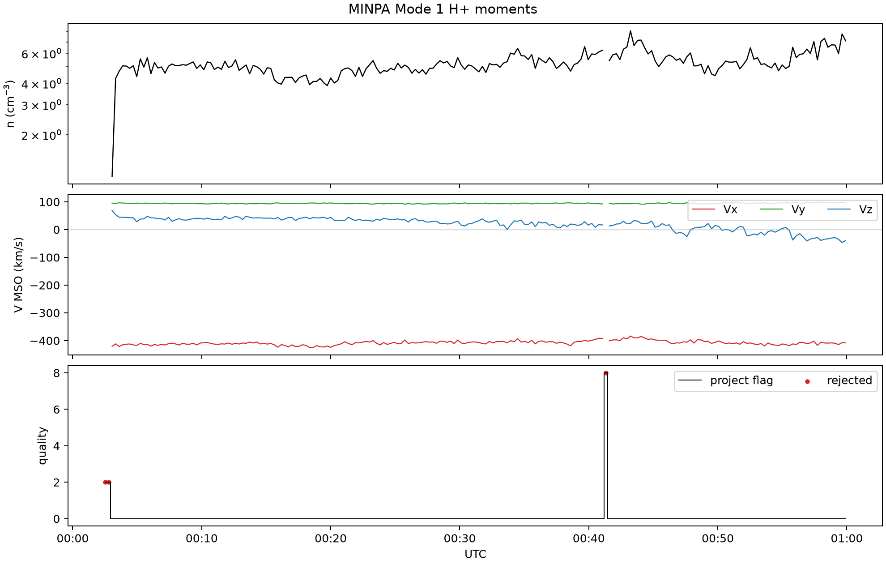
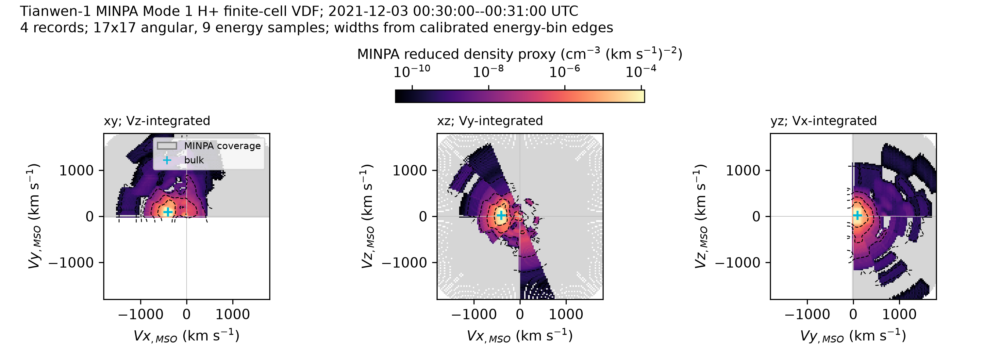
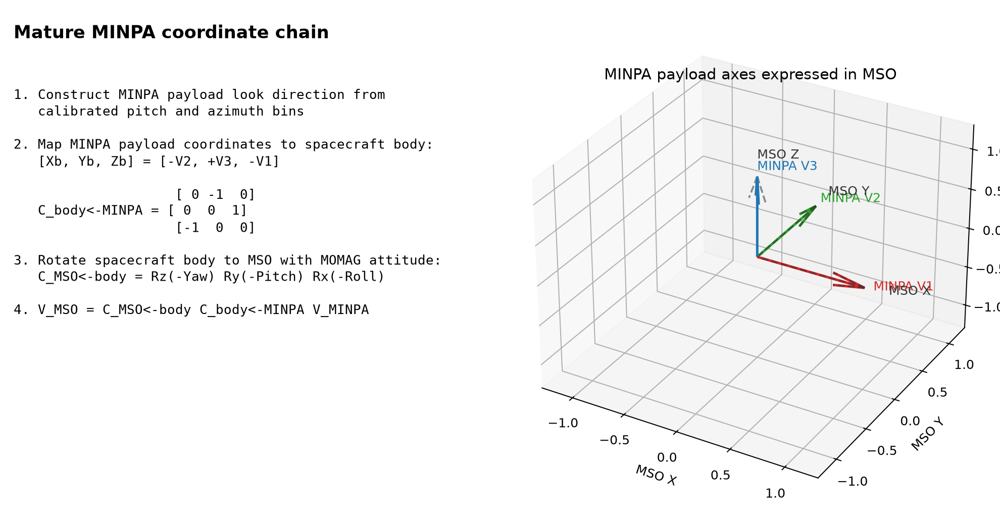

# High-E O+ / O2+ Mars Ion Products

This repository builds high-energy ion moment products for Mars spacecraft data.
Implemented routes are MAVEN STATIC-D1 and Tianwen-1 MINPA.

## MINPA channel denoising v2.2.0

The repository includes the frozen, time-invariant background models for
MINPA Modes 1, 4, and 12, plus one human-approved before/after example for
every Mode × H+/O+/O2+ combination.

Install and verify the release without downloading mission data:

```powershell
python -m pip install -e .[test]
python scripts/verify_minpa_v2_2_0_release.py
```

The frozen bundle is
[`release/minpa_unified_static_channel_denoise_v2.2.0/bundle.json`](release/minpa_unified_static_channel_denoise_v2.2.0/bundle.json),
with SHA-256
`0c21995c2b3baf7ba82e0893aa0aa5c81c17f268787b28e3d75181dcac468c71`.
The reviewed figures and decision manifest are under
[`examples/minpa_denoise_v2.2.0/`](examples/minpa_denoise_v2.2.0/).



Apply the correction to a local read-only MINPA archive explicitly:

```powershell
python scripts/run_tw1_highE_day.py 20211231 `
  --ori-root D:\Data\TW-1\result\MINPA\ori `
  --background-policy all-approved-static-channel-subtract `
  --static-background-bundle release\minpa_unified_static_channel_denoise_v2.2.0\bundle.json
```

Background subtraction remains disabled by default. Raw mission data are not
redistributed; the README in the example directory lists the inputs and exact
commands needed to regenerate the figures locally.

The approved calibration windows are published only as UTC locators in
[`calibration_intervals_approved.csv`](release/minpa_unified_static_channel_denoise_v2.2.0/calibration_intervals_approved.csv).
No per-window spectra, review figures, scores, or intermediate statistics are
included.

## MINPA raw-to-product quickstart

The repository now contains a self-contained Python route from a released
MINPA `.2B` file or local read-only `ori/*.mat` file to:

- solid-angle weighted H+, O+, and O2+ DPF/DEF energy spectra;
- density, scalar temperature, and three velocity components in MINPA payload,
  spacecraft-body, and MSO coordinates;
- project quality flags and preserved native `Quality` values;
- finite-energy/finite-angle XY, XZ, and YZ reduced VDF projections with
  geometric coverage shown separately from signal;
- CSV/NPZ products, figures, and a JSON provenance record.

Install and run the checked real-data example:

```powershell
python -m pip install -e .
python examples\minpa_mode1_quickstart.py
```

Or run an arbitrary single-mode file:

```powershell
python scripts\run_minpa_pipeline.py `
  D:\Data\TW-1\result\MINPA\ori\HX1-Or_GRAS_MINPA-MOD1-DEF_SCI_N_20211202191251_20211203011723_00639_A.mat `
  --species H+ `
  --start 2021-12-03T00:00:00Z --stop 2021-12-03T01:00:00Z `
  --vdf-start 2021-12-03T00:30:00Z --vdf-stop 2021-12-03T00:31:00Z
```

The example writes only under `docs/assets/minpa_mode1_example/`; source data
remain read-only. Its time-series figures cover 2021-12-03 00:00--01:00 UTC;
the finite-cell VDF uses 00:30--00:31 UTC within the same Mode-1 interval:

Energy integration uses per-channel logarithmic edges inferred from adjacent
calibrated energy centers (`dE_i = E_high,i - E_low,i`), not a fixed 15% width.
Coordinates use the explicit chain
`MINPA payload [-V2,+V3,-V1] -> spacecraft body -> MSO`.









Start with [`docs/minpa_processing_guide.md`](docs/minpa_processing_guide.md)
for mode layouts, equations, coordinate conventions, quality flags, background
handling, limitations, and extension examples.  The central implementation is:

```text
src/highE/minpa_modes.py       calibration tables and layouts for Modes 1-12
src/highE/minpa_io.py          ori/.2B read-only parsing and diagnostics
src/highE/minpa_quality.py     five project problem bits
src/highE/minpa_processing.py  spectra, moments, and VDF projection
src/highE/minpa_pipeline.py    time-series products and CSV/NPZ output
src/highE/minpa_plots.py       reproducible figures
```

To validate axis signs and rotation order against existing local legacy
products, run `scripts/validate_minpa_coordinate_chain.py` with explicit
`--ori`, `--nv`, `--nv-mso2`, and `--momag-root` paths. The script is read-only
and reports density, intermediate-vector, and MSO-vector errors separately.
The checked example report is
[`validation_nv_mso_2.json`](docs/assets/minpa_mode1_example/validation_nv_mso_2.json):
the all-energy H+ density/current-reference median ratio is `0.99999983`, and
the stored payload-vector to MSO rotation agrees to about `6e-14 km/s`.

Important limitations: local acceptance data currently cover Modes 1, 4, 7,
and 12. Modes 9-11 resolve H+ only. Mode 12 resolves spectrum and density, but
its released subrecord has one azimuth-integrated angular cell, so independent
three-component velocity and a 2-D VDF are returned as unavailable. Background
subtraction is never enabled by default. The frozen Mode-1 v1.1.0 path remains
available. The finalized v2.2.0 bundle supports reviewed channels in Modes 1,
4, and 12; automatic rc1 candidates remain ineligible, and Mode 7 remains
uncorrected.

## Implemented MAVEN Route

Run one UTC day without writing output:

```powershell
python scripts\run_maven_highE_day.py 20211203 --no-write
```

Run one UTC day and write the default product:

```powershell
python scripts\run_maven_highE_day.py 20211203
```

Default output root:

```text
E:\Data\highE
```

Output files:

```text
E:\Data\highE\MAVEN\YYYY\maven_static_highE_Oplus_YYYYMMDD.mat
E:\Data\highE\MAVEN\YYYY\maven_static_highE_O2plus_YYYYMMDD.mat
E:\Data\highE\MAVEN\YYYY\maven_static_highE_YYYYMMDD_summary.json
```

Each species file has one row per STATIC timestamp. O+ and O2+ are not stacked
into one file, so no output file contains duplicate time points.

The species MAT files include `mse_plus_z_in_static_fov_flag`, a per-epoch flag
where `1` means the MSE +Z direction is inside the STATIC FOV and `0` means it
is outside. Invalid or non-determinable epochs are stored as `NaN`. The
supporting fields `mse_plus_z_static_x/y/z` and
`mse_plus_z_static_theta_deg` record the projected direction in STATIC
coordinates.

For multiple dates, use date-level parallelism:

```powershell
python scripts\run_maven_highE_batch.py 20211203 20211204 --workers 2
```

For already written products under `E:\Data\highE\MAVEN`, generate standalone
per-day +Z_MSE FOV flag files without recomputing moments:

```powershell
python scripts\run_maven_static_plus_z_fov_flags.py --dates 20141017 --dry-run
python scripts\run_maven_static_plus_z_fov_flags.py --dates 20141017
```

This writes:

```text
E:\Data\highE\MAVEN\YYYY\maven_static_plus_z_fov_flag_YYYYMMDD.mat
E:\Data\highE\MAVEN\YYYY\maven_static_plus_z_fov_flag_YYYYMMDD_summary.json
```

## Current Scientific Assumptions

- O+ mass window: `14.5-17.5 amu/e`.
- O2+ mass window: `30-34 amu/e`.
- High-energy threshold: raw STATIC `energy > 1000 eV`.
- `sc_pot` is recorded but not used for the high-energy threshold or speed.
- MAVEN position comes from `Spss[:,1:4]` in
  `D:\Data\MAVEN\result\mag\ss1s\BssYYYYMMDD.mat`.
- Velocity and position are transformed from MSO to MSE using
  `D:\Data\MAVEN\result\R_MSO2MSE`.
- FOV output includes the STATIC/App coordinate axes in MSO and MSE and a
  +Z_MSE in/out STATIC FOV flag based on the fixed STATIC theta-edge range.

See `docs/method_maven_static_highE.md` for details.

## Implemented Tianwen-1 Route

Run one UTC day without writing output:

```powershell
python scripts\run_tw1_highE_day.py 20211203 --no-write
```

Run one UTC day and write the default product:

```powershell
python scripts\run_tw1_highE_day.py 20211203
```

Output files:

```text
E:\Data\highE\Tianwen-1\YYYY\tw1_minpa_highE_Oplus_YYYYMMDD.mat
E:\Data\highE\Tianwen-1\YYYY\tw1_minpa_highE_O2plus_YYYYMMDD.mat
E:\Data\highE\Tianwen-1\YYYY\tw1_minpa_highE_YYYYMMDD_summary.json
```

MINPA source priority is `D:\Data\TW-1\result\MINPA\ori` first, then
`D:\Data\TW-1\rawdata\MINPA\public` only when no overlapping `ori` files exist.
Velocity and position are transformed from MSO to MSE using
`D:\Data\TW-1\result\R_MSO2MSE`.

MINPA FOV is treated with its own theta-edge logic, not STATIC's `+-45 deg`
theta range. The product records spacecraft-body axes in MSO/MSE and a
`mse_plus_z_in_minpa_fov_flag` based on the MINPA ion `360 deg x 90 deg`
hemisphere. See `docs/method_tw1_minpa_highE.md`.

The Tianwen-1 MOMAG Roll/Pitch/Yaw orbiter-body to MSO matrix and a read-only
validation workflow are documented in `docs/method_tw1_momag_body_to_mso.md`.

### MINPA Mode 1 exploratory background evolution

Run the resumable full-mission Mode 1 inventory, monthly quiet-window
classification, day-block statistics, change-point analysis, and figures with:

```powershell
python scripts\run_minpa_background_temporal.py --stage all `
  --day-spe-root D:\Data\TW-1\result\MINPA\day_spe `
  --ori-root D:\Data\TW-1\result\MINPA\ori `
  --quality-root outputs\tw1_minpa_quality_flags_all_species `
  --workers 4
```

Outputs are written separately under `outputs/minpa_background_temporal/`.
The analysis is exploratory and does not write a production background model
or recompute moments. Use `--stage quarterly` to regenerate the quarterly
day-block contrasts from completed month checkpoints. See
`docs/method_minpa_background_temporal.md`.

## MSE Spatial Statistics

Build separate MAVEN and Tianwen-1 3-D MSE grids for O+ and O2+, split by
whether MSE `+Z` is inside each instrument FOV:

```powershell
python scripts\run_mse_spatial_stats.py --workers 4
```

This writes data, center-slice figures, and logs under:

```text
E:\Data\highE\processed_mse_spatial_stats
```

The statistical grid uses `Rm = 3397 km`, `0.1 Rm` spacing, MAVEN limits of
`+-3 Rm`, Tianwen-1 limits of `+-7 Rm`, and treats densities below
`0.001 cm^-3` as invalid. See `docs/method_mse_spatial_stats.md`.

## Tianwen-1 Per-Cell MSE Records

For a streaming archive of individual MINPA epochs rather than aggregated grid
statistics, run:

```powershell
python scripts\run_tw1_mse_grid_records.py --input-root D:\Data\highE\Tianwen-1 --output-root D:\Data\highE\processed_mse_spatial_stats\tw1_minpa_grid_records_5Rm
```

After the complete run stops successfully, remove empty transaction groups and
audit every HDF5 cell-day and record:

```powershell
python scripts\audit_tw1_mse_grid_records.py --input-root D:\Data\highE\Tianwen-1 --output-root D:\Data\highE\processed_mse_spatial_stats\tw1_minpa_grid_records_5Rm --cleanup-empty-staging
```

For an unattended production run, a separate watcher may be launched with the
writer PID. It audits only after the writer exits and all 1029 days plus the
final run summary are confirmed; otherwise it records `production_incomplete`
without modifying the outputs:

```powershell
python scripts\watch_and_audit_tw1_mse_grid_records.py --writer-pid PID
```

This workflow uses a `100 x 100 x 100` MSE grid with `0.1 Rm` cells and strict
outer edges at `+-5 Rm` for `Rm = 3397 km`. It reads one O+/O2+ daily pair at a
time, recomputes position and velocity with the daily MSO-to-MSE matrices, and
writes one incrementally updated HDF5 file per non-empty cell. It retains all
in-grid finite-position records, including records with invalid moments and
their quality flags. The per-species HDF5 groups include the five-problem
`NV_MSO_2` bitmask, all five explicit bits, availability, and epoch-match
metadata. See `docs/method_tw1_mse_grid_records.md`.

The audited 1029-day production archive is under
`D:\Data\highE\processed_mse_spatial_stats\tw1_minpa_grid_records_5Rm`.
`logs/full_audit_summary.json` records zero audit errors across 156,033 HDF5
files, 565,545 cell-day groups, and 3,539,768 retained in-grid records.
`logs/day_summary_provenance_audit.json` additionally passes all 1029 daily
summaries and 4,116 O+/O2+/rotation/NV provenance paths, including 128 dates
with no records inside the requested grid.

## Tianwen-1 MINPA All-Energy MSE Grid Records

Archive the `NV_MSO_2` full-energy H+, O+, and O2+ density and bulk-velocity
records in the same `0.1 Rm`, `[-5,+5] Rm` per-cell HDF5 organization:

```powershell
python scripts\run_tw1_all_energy_mse_grid_records.py
python scripts\audit_tw1_all_energy_mse_grid_records.py --cleanup-empty-staging
```

The workflow uses the true UTC date of each row to remove adjacent-product
duplicates, reads position and rotation geometry for that true date, rotates
all three species from MSO to MSE, and preserves all species-specific five-bit
quality flags. The 59-field output is separate from the `>1 keV` archive at
`D:\Data\highE\processed_mse_spatial_stats\tw1_minpa_all_energy_grid_records_5Rm`.
See `docs/method_tw1_all_energy_mse_grid_records.md` for source semantics,
status codes, missing-geometry coverage, and validation.

The completed production archive contains 3,979,338 in-grid records in
155,145 HDF5 cell files and 558,551 cell-day groups. The independent audit
reconstructed all processable source days and passed with zero errors and zero
sample mismatches; authoritative counts are in `logs/full_audit_summary.json`.

## Tianwen-1 MSE X-Z Mean Maps

Compute valid-record, record-weighted X-Z projections from the audited
per-cell HDF5 archive and write separate density, speed, Vx, Vy, and Vz maps
for O+ and O2+:

```powershell
python scripts\plot_tw1_mse_xz_means.py --workers 4
```

The default selection rejects NaN values and NV_MSO_2 problem classes 2-5 but
retains class 1 as caution. Density and speed maps contain their base-10 logarithms. The three signed MSE
velocity components are plotted separately with a zero-centered diverging
color scale. See `docs/method_tw1_mse_xz_means.md` for quality filtering,
aggregation, units, and output provenance.

For the full-energy `NV_MSO_2` moments, generate the same all-Y X-Z products
for H+, O+, and O2+ with:

```powershell
python scripts\plot_tw1_all_energy_mse_xz_means.py --workers 4
```

This writes separate density, speed, `Vx`, `Vy`, and `Vz` maps and their NPZ
sufficient statistics under
`D:\Data\highE\processed_mse_spatial_stats\tw1_minpa_all_energy_mse_xz_means_5Rm`.
The production run processed all 155,145 cell files and retained 2,550,289 H+,
1,021,762 O+, and 747,676 O2+ valid records. See
`docs/method_tw1_all_energy_mse_xz_means.md`.

Classify the full-energy H+/O+/O2+ moments by whether `+Xb_MSE` lies within
45 degrees of `+Z_MSE` or `-Z_MSE`, and project the exact
`-0.5 <= Y_MSE <= 0.5 Rm` slab with:

```powershell
python scripts\plot_tw1_all_energy_mse_xz_xb_classes.py --workers 4
```

The two classes use shared comparison color limits and each contains density,
speed, density-speed flux, `Vx`, `Vy`, and `Vz` maps. Outputs are under
`D:\Data\highE\processed_mse_spatial_stats\tw1_minpa_all_energy_mse_xz_xb_classes_y_m0p5_p0p5_5Rm`.
See `docs/method_tw1_all_energy_mse_xz_xb_classes.md`.

## Tianwen-1 +Xb_MSE FOV classes

Split the valid MINPA statistics into the two body-axis orientation classes
`angle(+Xb_MSE,+Z_MSE) <= 45 deg` and
`angle(+Xb_MSE,-Z_MSE) <= 45 deg`:

```powershell
python scripts\plot_tw1_mse_xz_fov_classes.py --workers 4
```

The workflow reads daily products, rotates/validates the orbiter `+Xb` axis,
applies the established NaN and NV_MSO_2 flag rules, and writes separate O+ and
O2+ 3-D means and X-Z maps with shared comparison color scales. The command
defaults to the inclusive slab `-1 <= Y_MSE <= 1 Rm`; change it with
`--y-min-rm` and `--y-max-rm`. It also writes and plots the logarithm of the
density-speed flux `mean_density * mean_speed * 1e5` in `cm^-2 s^-1`. See
`docs/method_tw1_mse_xz_fov_classes.md`.

To derive `0.2 Rm` X-Z maps from the existing `0.1 Rm` sufficient statistics
while preserving the exact `-0.5 <= Y_MSE <= 0.5 Rm` source slab:

```powershell
python scripts\rebin_tw1_mse_xz_fov_classes.py
```

This command sums counts and physical sums before recomputing means; it does
not average cell means. X and Z are coarsened to `0.2 Rm`, while the Y sample
selection remains the ten original `0.1 Rm` layers bounded by `+/-0.5 Rm`.

## MINPA background correction

The current all-approved static release is
`minpa-unified-static-channel-denoise-v2.2.0`. It rebuilds Mode 1 from 295
approved entries (273 exact-time unique intervals), reuses the frozen Mode-4/12
v2.0.0 approved models, and intentionally applies no temporal scaling:

```powershell
python scripts\run_tw1_highE_day.py 20211231 `
  --background-policy all-approved-static-channel-subtract `
  --static-background-bundle release\minpa_unified_static_channel_denoise_v2.2.0\bundle.json
```

See `docs/release_minpa_unified_static_denoise_v2.2.0.md` for the estimator,
scope, support counts, hashes, validation, rebuild command, and GitHub release
packaging notes. The default remains `none`. The committed examples are the
9 signal figures retained in the final review; each file already contains the
raw and corrected panels. Only the aggregate count of 18 rejected candidates
is retained.

Build the provisional paper-method reproduction, validate its effect on the
high-energy O+/O2+ moment chain, and write a separate corrected daily product:

```powershell
python scripts\reproduce_minpa_background_paper.py --use-provisional-candidates
python scripts\reproduce_minpa_paper_figure5.py
python scripts\analyze_minpa_manual_background_windows.py
python scripts\find_minpa_pure_background_candidates.py
python scripts\validate_minpa_manual_background_review.py
python scripts\audit_minpa_background_reproduction_inputs.py
python scripts\validate_minpa_background_moments.py
python scripts\run_tw1_highE_day.py 20211231 `
  --output-root outputs\minpa_background_paper_reproduction\moment_products `
  --background-policy subtract-and-reject-uv `
  --background-model outputs\minpa_background_paper_reproduction\data\minpa_mode1_background_model_provisional.npz `
  --allow-provisional-background-model
```

The historical default remains `--background-policy none`. The background
interval policy retains project quality bits 1, 2, and 5 and rejects only bits
3 and 4 (mask `0x0C`). A Mode-1 model is never applied to Mode 4/12. The
separate multimode policy requires a finalized hash-verified bundle. The frozen
v2.0.0 bundle is at `outputs/minpa_multimode_channel_denoise_v2.0.0/bundle.json`;
rc1 and prefilter review candidates remain refused. Provisional Mode-1 models require the explicit allow switch and write `_bgcorr_provisional_v1`
products without overwriting existing moment files. See
`docs/method_minpa_background_reproduction.md` for estimator definitions, UV
record rejection, validation, and the paper-figure reproduction matrix.
The Mode-4/12 extension is documented in
`docs/method_minpa_multimode_noise_denoise.md`; the frozen release, channel
support limitations, hashes, and validation are recorded in
`docs/release_minpa_multimode_denoise_v2.0.0.md`.
The 40 low-total-count interval candidates are additionally screened for
coherent H+ ridges; 21 currently remain. Figure 5 is reproduced separately in
H+ count-equivalent space with the paper's nonzero-channel estimator. The old
`figures03_05_h_spectra_raw_corrected.png` DEF comparison is deprecated because
its production estimator had zero background in most sparse cells.
The detailed paper-derived acceptance targets and data gaps are recorded in
`docs/minpa_background_paper_reproduction_spec.md`.

SWIA Figures 6--8 and the Figure 11 H+ Maxwellian fit are downstream moment
checks and are not inputs to MINPA background estimation, so they are excluded
from this workflow. MOMAG is used only as interval-review context.
